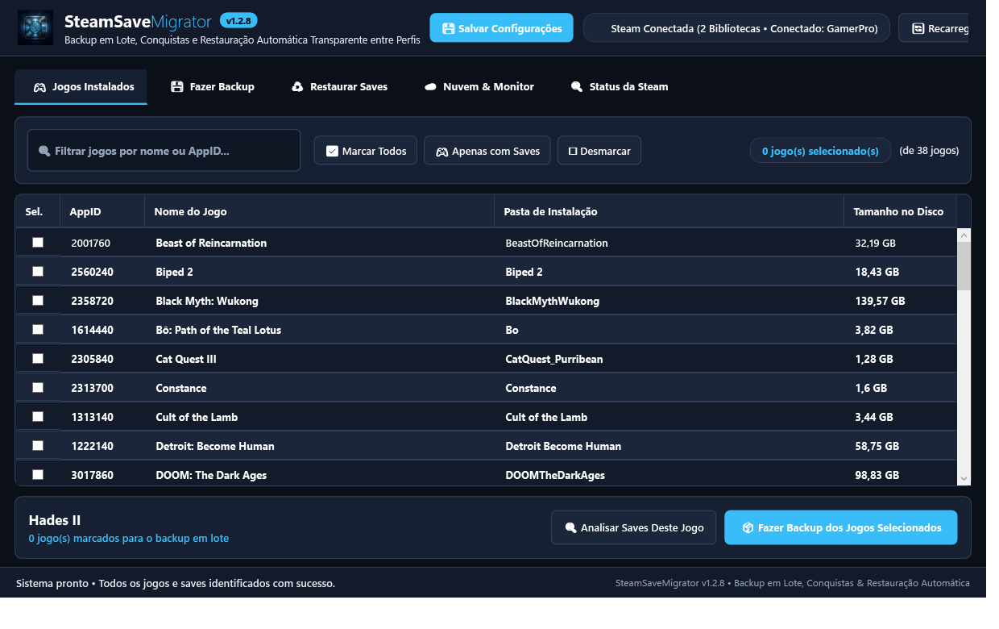
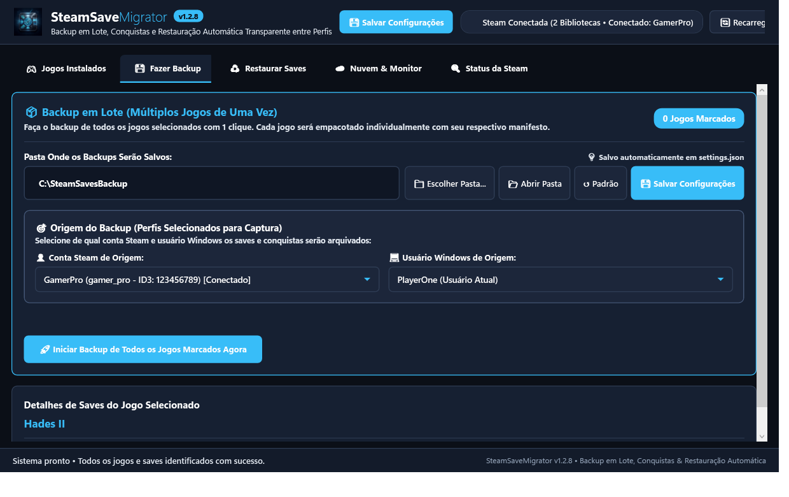
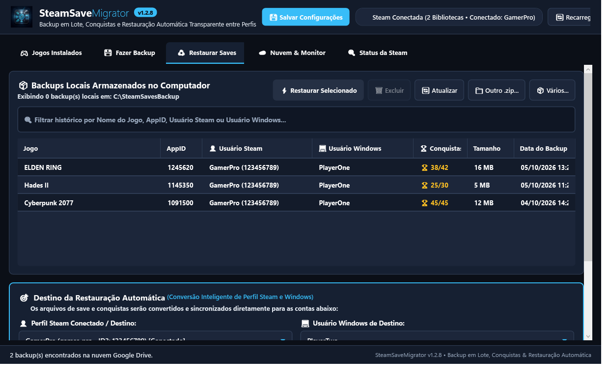
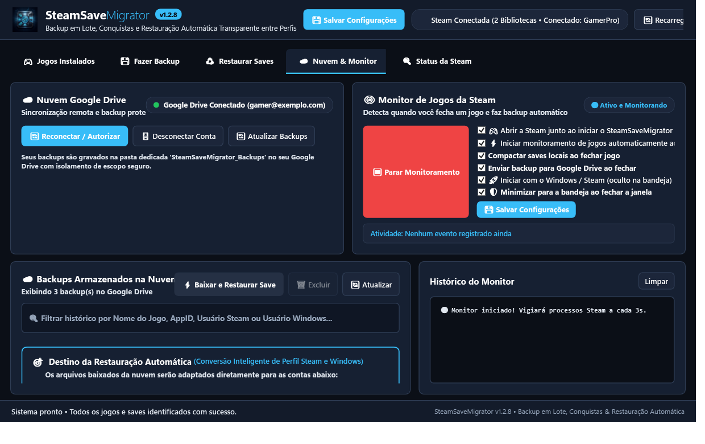
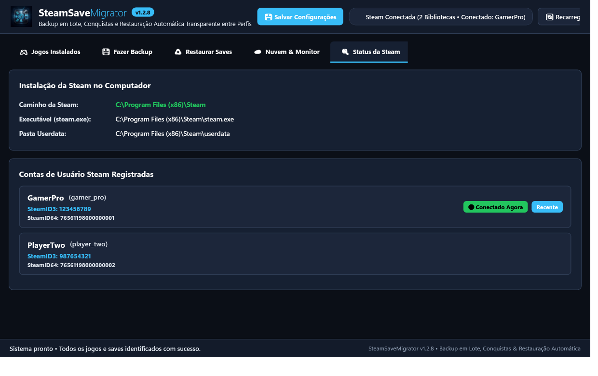

# 🎮 SteamSaveMigrator

<div align="center">


### Utilitário Moderno em C# (.NET / WPF) para Detecção, Backup em Lote, Conquistas e Restauração Automática Transparente de Saves da Steam entre Perfis do Windows

[](https://dotnet.microsoft.com/)
[](https://www.microsoft.com/windows)
[](https://github.com/)
[](LICENSE)
[](SECURITY.md)
[](CONTRIBUTING.md)

</div>

---

## 📖 Visão Geral

O **SteamSaveMigrator** resolve um dos problemas mais comuns enfrentados por jogadores de PC: **transferir saves de jogos entre diferentes usuários do Windows, formatar o sistema, trocar de computador ou migrar contas da Steam sem perder progresso e conquistas**.

Muitos jogos armazenam saves e dados em locais dispersos do sistema (`%USERPROFILE%`, `%APPDATA%`, `%LOCALAPPDATA%`, `%SAVEDGAMES%`, Documentos e nas pastas de `userdata` da Valve). Ao trocar de perfil do Windows ou de máquina, os caminhos absolutos ficam corrompidos ou inacessíveis.

Com o **SteamSaveMigrator**, você faz backup de múltiplos jogos com apenas **1 clique** e restaura tudo de forma **100% automatizada**, onde o motor inteligente converte e adapta os caminhos entre perfis de origem e destino sem necessidade de intervenção manual.

---

## 📸 Fotos do Aplicativo (Capturas de Tela)

### 1. 🎮 Lista de Jogos Instalados & Seleção em Lote
> Filtro em tempo real por nome ou AppID, cálculo automático de espaço em disco, identificação instantânea de saves locais e botões rápidos para seleção em lote.



---

### 2. 💾 Análise Detalhada & Fazer Backup em Lote
> Selecione o destino do backup, escolha a conta Steam e perfil Windows de origem, e empacote todos os saves com cálculo de integridade SHA-256 e manifesto estruturado.



---

### 3. ♻️ Restauração Automática em 1 Clique (Zero Complicação)
> Identifica automaticamente o usuário e caminhos de origem e converte transparentemente para o novo perfil do Windows e nova conta Steam. Suporta visualização de conquistas e histórico de backups locais.



---

### 4. ☁️ Sincronização em Nuvem (Google Drive) & Monitor de Jogos
> Monitoramento contínuo em segundo plano (System Tray) que detecta quando um jogo é fechado e realiza backup/upload automático para o Google Drive com isolamento seguro de escopo.



---

### 5. 🔍 Diagnóstico e Detecção da Steam
> Detecção profunda do registro do Windows, executáveis, pastas de bibliotecas em múltiplos discos (SSD/HD) e contas Steam ativas na máquina.



---

## ✨ Principais Funcionalidades

- **📦 Backup em Lote Multijogos**:
  - Selecione múltiplos jogos e empacote todos com apenas 1 clique.
  - Geração de pacotes ZIP compactados individuais com checksum SHA-256 e manifesto JSON estruturado.
- **⚡ Restauração 100% Automática**:
  - Lê o manifesto original e detecta o perfil de origem (ex: `C:\Users\AntigoUsuario`).
  - Identifica o usuário logado atual (`Environment.UserName`).
  - Traduz automaticamente todas as variáveis de ambiente do Windows (`%USERPROFILE%`, `%APPDATA%`, `%LOCALAPPDATA%`, `%SAVEDGAMES%`, `%DOCUMENTS%`, `%STEAM_USERDATA%`).
  - Modo **Simulação (Dry-Run)** para conferir todas as ações antes de gravar no disco.
- **☁️ Integração com Google Drive**:
  - Sincronize seus backups com sua conta pessoal do Google Drive na nuvem.
  - Baixe e restaure backups remotos com suporte a controle de versão e cotas.
- **🛡️ Game Watcher (Monitor em Segundo Plano)**:
  - Fica minimizado na bandeja do sistema (System Tray).
  - Detecta automaticamente quando você fecha qualquer jogo da Steam e cria/envia o backup de save atualizado.
- **🏆 Preservação de Conquistas (Achievements)**:
  - Arquiva estatísticas e metadados de conquistas compatíveis com Steamworks.
- **💻 CLI Interativo & Scripts**:
  - Além da interface gráfica moderna em WPF, inclui uma CLI rápida com **Spectre.Console** para automações e servidores.

---

## 📐 Arquitetura do Projeto

```
SteamSaveMigrator
│
├── 🔍 Detectar Steam & Jogos
│       ├── Registro do Windows (HKCU / HKLM) e caminhos padrão
│       ├── Contas de usuário (config/loginusers.vdf e userdata/<SteamID3>)
│       ├── Bibliotecas em múltiplos discos (steamapps/libraryfolders.vdf)
│       └── Manifestos VDF (appmanifest_<appid>.acf)
│
├── 💾 Sistema de Backup
│       ├── Steam Userdata (<SteamPath>/userdata/<SteamID3>/<AppID>)
│       ├── AppData (Local, LocalLow, Roaming)
│       ├── Documents (Documentos, My Games)
│       ├── Saved Games (pasta nativa de jogos do Windows)
│       └── Pacote ZIP com integridade SHA-256 e manifesto JSON
│
├── ♻️ Restauração Transparente
│       ├── Conversão inteligente de caminhos entre perfis de usuário
│       ├── Modo Simulação (Dry-Run)
│       └── Preservação de timestamps e integridade original
│
└── 🔄 Motor de Conversão de Caminhos
        C:\Users\UsuarioOrigem
                  ↓
        %USERPROFILE% / %LOCALAPPDATA% / %APPDATA% / %DOCUMENTS% / %SAVEDGAMES%
                  ↓
        C:\Users\UsuarioDestino
```

---

## 📂 Estrutura do Código-Fonte

- `src/SteamSaveMigrator.Core/`:
  - **Detectors/**: Detecção de instalações Steam, jogos e scanner heurístico de pastas de saves.
  - **Parsers/**: Parser de alta fidelidade para arquivos KeyValues (VDF / ACF) da Valve.
  - **Paths/**: Motor `PathVariableConverter` e resolução de pastas especiais do Windows.
  - **Services/**: Serviços de Backup, Restauração, Google Drive e monitoramento `SteamGameWatcherService`.
- `src/SteamSaveMigrator.Wpf/`:
  - Interface gráfica moderna com MVVM, tema Dark Fluent/Steam, bandeja do sistema (System Tray) e notificações.
- `src/SteamSaveMigrator.Cli/`:
  - Interface de linha de comando para terminal rica em menus interativos.
- `tests/SteamSaveMigrator.Tests/`:
  - Suíte completa de testes automatizados com **xUnit**.

---

## 🔒 Segurança e Boas Práticas para Forks

Este repositório foi **sanitizado e configurado** de acordo com rigorosos padrões de segurança:

- **Nenhum dado pessoal** (nomes reais, Steam IDs privados ou credenciais) está exposto no código ou nos testes.
- **Nenhum arquivo de save pessoal** é versionado: a pasta `backups/` e extensões de arquivos de saves (`*.zip`, `*.sl2`, `*.sav`, `*.dat`) estão protegidas pelo `.gitignore`.
- **Configuração do Google Drive em Forks**:
  - Para usar a integração com Google Drive em seu próprio fork ou compilação local, configure suas credenciais OAuth do Google Cloud através de:
    1. **Variáveis de Ambiente**:
       ```powershell
       $env:GOOGLE_CLIENT_ID = "SEU_CLIENT_ID.apps.googleusercontent.com"
       $env:GOOGLE_CLIENT_SECRET = "SEU_CLIENT_SECRET"
       ```
    2. **Arquivo de Configuração**:
       - Copie o arquivo `client_secret.example.json` para `client_secret.json` na raiz da aplicação.
    3. **Pela Interface Gráfica**:
       - Clique em **"Configurar Credenciais do Google"** na aba *Nuvem & Monitor* e importe o arquivo JSON ou cole as chaves.

Para detalhes completos de segurança e privacidade, consulte o documento [SECURITY.md](SECURITY.md).

---

## 🚀 Como Executar

### Pré-requisitos
- **Windows 10** ou **Windows 11**
- [.NET SDK 8.0, 9.0 ou 11.0](https://dotnet.microsoft.com/download)

### 1. Clonar o Repositório
```bash
git clone https://github.com/SEU_USUARIO/SteamSaveMigrator.git
cd SteamSaveMigrator
```

### 2. Executar os Testes Automatizados
```powershell
dotnet test
```

### 3. Executar o Aplicativo WPF (Interface Gráfica)
```powershell
dotnet run --project src/SteamSaveMigrator.Wpf/SteamSaveMigrator.Wpf.csproj
```

### 4. Executar a Interface CLI (Terminal)
```powershell
dotnet run --project src/SteamSaveMigrator.Cli/SteamSaveMigrator.Cli.csproj
```

### 5. Compilar em Modo Release
```powershell
dotnet publish src/SteamSaveMigrator.Wpf/SteamSaveMigrator.Wpf.csproj -c Release -r win-x64 --self-contained -o dist/publish_win64
```

---

## 🤝 Como Contribuir

Contribuições são muito bem-vindas! Se você deseja adicionar regras de detecção para novos jogos, sugerir melhorias de desempenho ou traduzir a interface:

1. Leia as diretrizes no [CONTRIBUTING.md](CONTRIBUTING.md).
2. Abra uma [Issue](https://github.com/) para discutir sua proposta.
3. Envie um Pull Request!

---

## 📜 Licença

Distribuído sob a licença **MIT**. Veja o arquivo [LICENSE](LICENSE) para mais detalhes.
